<h1 align="center">AI AGENT FOR SHOP</h1>

This AI agent is designed to assist customers in the market by understanding natural language queries, searching for products, checking availability, placing orders and answering general questions.

<h2>TECH STACK</h2>
<ul>
  <li>Python 3.13.2</li>
  <li>PostgreSQL + pgvector(vector storage for embeddings)</li>
  <li>FastAPI (API endpoints)</li>
  <li>Pydantic (data validation)</li>
  <li>Docker(Dockerfile and docker-compose)</li>
  <li>LangChain(agent logic)</li>
  <li>LangGraph(agent workflow)</li>
  <li>LLMs (intent classification, NER and outputs)</li>
  <li>Embedding model (text embeddings)</li>
  <li>Reranker model (rerank rag results)</li>
  <li>Sequence to sequence model (translate the request into the language)</li>
</ul>

<h2>DEPLOYMENT</h2>

The whole project runs via <b>Docker Compose</b>.
Services:

<ul>
  <li>app service: FastAPI for API endpoints.</li>
  <li>PostgreSQL database with <b>pgvector</b>.</li>
  <li>Ollama server hosting the LLM model(llama3.2:3b).</li>
</ul>

<h2>HOW IT WORKS</h2>

The user sends a request. The agent determines the intent using LLM. The slots are extracted using the NER tool, then performs an action. The response is created and returned to the user. If necessary, the agent asks for confirmation.

<h2>AGENT FUNCTIONALS:</h2>
<h3>INTENT CLASSIFICATION</h3>
 

The project uses an <code>intents.json</code> file that contains all intents and their descriptions. This allows the model to understand in the prompt what each intent is responsible for. The file also includes slots that need to be filled by the NER models.

 
EXAMPLE:
 
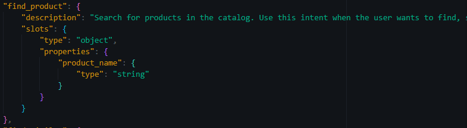

<h4>INTENTS:</h4>
<ul>
<li>Find products.</li>
<li>Find similar.</li>
<li>Get order/s.</li>
<li>Make order/s.</li>
<li>Answer general question/s.</li>
<li>Did not classified(if model could not classify user query).</li>
</ul>

File is located in src/intents.json

<h3>TOOLS:</h3>
<ul>
<li>Find products in whole marketplace.</li>
<li>Find similar products on user query.</li>
<li>Get user orders(in future, we can bind on user account).</li>
<li>Make order/s with use articles of products.</li>
<li>Answer for general client questions.</li>
</ul>

<h2>THE GRAPHS LOOK LIKE THIS:</h2>
<h3>Main graph:</h3>
 
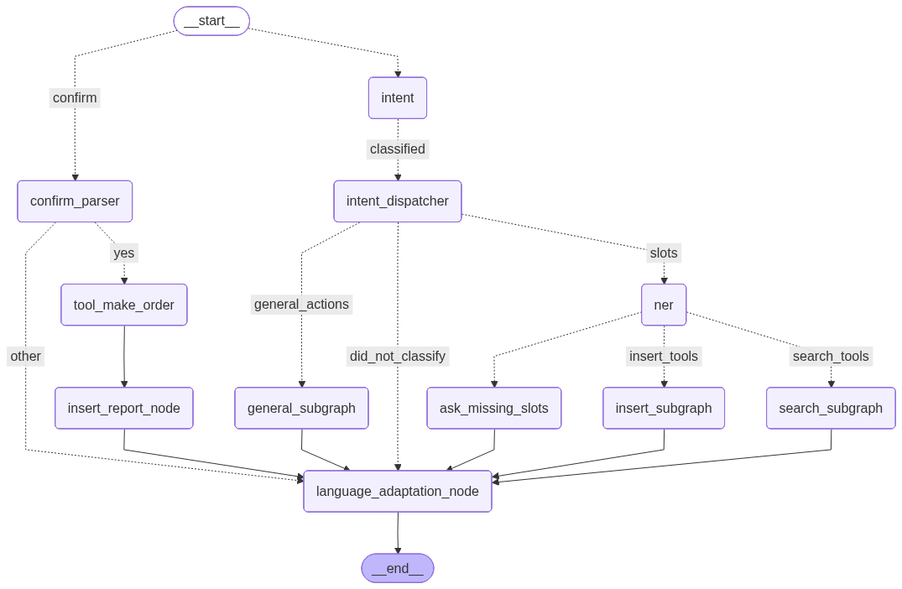

<h3>Subgraphs:</h3>

1) Subgraph for search operations:
 
    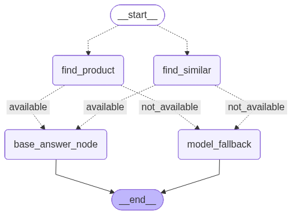  

2) Subgraph for insert operations:
 
    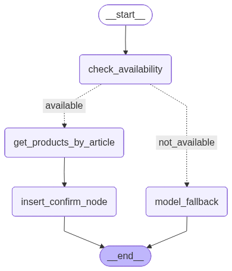  

3) Subgraph for general operations:
 
    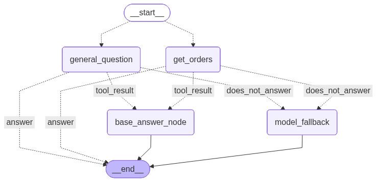

<h2>EXAMPLES</h2>

<h3>Intent: make_order</h3>

>
<b>Step 1: Ask for confirmation</b>

>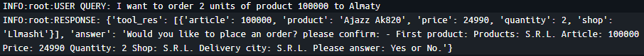

>
<b>Step 2: If confirmation is YES</b>

>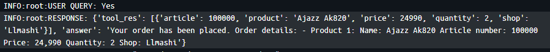

>
<b>Step 2: If confirmation is NO</b>

>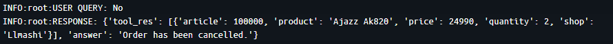

<h3>Intent: did_not_classified</h3>
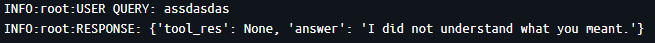

<h3>Slots extraction:</h3>
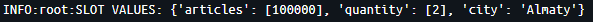

<h3>Missing slots:</h3>

<b>Agent response:
</b>
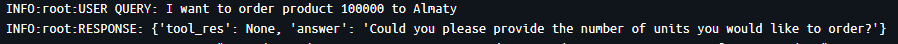

5) Intent: find product:

<h2>FUTURE IMPROVEMENTS</h2>
<ul>
  <li>Bind agent to real user accounts</li>
  <li>Integrate payment system for orders</li>
  <li>Enhance NER model for more accurate slot filling</li>
</ul>